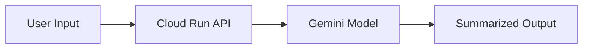

# ai-summarizer-agent

# 🚀 AI Text Summarizer Agent

### Powered by Gemini ✨ | Deployed on Cloud Run ☁️


---

## 🌟 Overview

This project is a **serverless AI agent** built using **Google Gemini (Vertex AI)** and deployed on **Cloud Run**.

It provides a simple API that takes long text input and returns a **concise, intelligent summary**.

---

## 🎯 Key Features

* ✨ AI-powered text summarization (Gemini 1.5 Flash)
* ⚡ Ultra-fast and scalable (Cloud Run auto-scaling)
* 🌐 Public REST API endpoint
* ☁️ Fully serverless architecture
* 🔒 Secure and production-ready setup

---

## 🧠 How It Works



---

## 📸 UI / API Preview

### 🔹 API Test (cURL)

```bash
curl -X POST https://ai-agent-581875674588.us-central1.run.app/summarize \
  -H "Content-Type: application/json" \
  -d '{"text": "Artificial Intelligence is transforming industries like healthcare, finance, and education..."}'
```

### 🔹 Sample Response

```json
{
  "summary": "AI is transforming industries by automating tasks and improving decision-making."
}
```

---

## 🔗 Live Demo

👉 **https://ai-agent-581875674588.us-central1.run.app**

---

## 🛠️ Tech Stack

| Layer      | Technology                   |
| ---------- | ---------------------------- |
| Backend    | Flask (Python)               |
| AI Model   | Gemini 1.5 Flash (Vertex AI) |
| Deployment | Cloud Run                    |
| Container  | Buildpacks                   |

---

## 📡 API Documentation

### Endpoint

```
POST /summarize
```

### Request

```json
{
  "text": "Your long input text"
}
```

### Response

```json
{
  "summary": "Short summarized text"
}
```

---

## ⚙️ Local Setup

### 1️⃣ Clone Repository

```bash
git clone https://github.com/abhinandan6123/ai-summarizer-agent.git
cd ai-summarizer-agent
```

### 2️⃣ Install Dependencies

```bash
pip install -r requirements.txt
```

### 3️⃣ Run Locally

```bash
python main.py
```

---

## 🚀 Deployment (Cloud Run)

```bash
gcloud run deploy ai-agent \
  --source . \
  --region us-central1 \
  --allow-unauthenticated
```

---

## 🔐 Prerequisites

* Google Cloud Project
* Vertex AI API enabled
* Billing enabled

---

## 📈 Future Enhancements

* 🎨 Add frontend UI (React/Streamlit)
* 🧠 Multi-agent system (ADK integration)
* 🔍 Add document summarization
* 🔐 Authentication layer

---

## 👨‍💻 Author

**Abhinandan Kancharla**
🔗 https://github.com/abhinandan6123

---

## 📜 License

Licensed under the **Apache 2.0 License**
